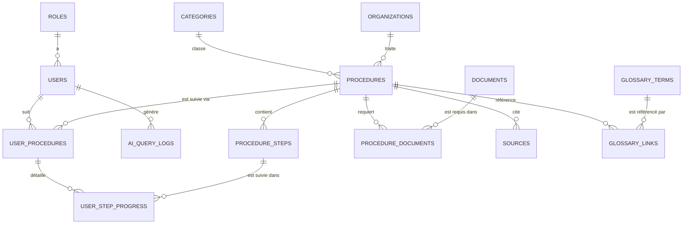

# Guidly — Modèle de données

Ce document détaille la base relationnelle qui sert de socle à tout le projet. C'est un point que je considère central dans l'architecture : c'est cette base, et pas le LLM, qui reste la source de vérité pour tout ce qui touche aux procédures administratives.

## Vue d'ensemble



Quelques choix que j'ai faits en construisant ce schéma, et pourquoi :

- Une procédure appartient à une catégorie et est rattachée à un organisme. Ça semblait le découpage le plus naturel pour permettre plus tard un filtrage par catégorie sur le frontend.
- Les documents sont dans une table à part, reliée aux procédures par une table de liaison (`procedure_documents`). J'ai fait ce choix parce qu'un même document — une pièce d'identité, par exemple — revient dans plusieurs démarches différentes ; ça évite de dupliquer l'information.
- Quand un utilisateur démarre une démarche, ça crée une ligne dans `user_procedures` — une sorte "d'instance personnelle" de la procédure — et chaque étape cochée devient une ligne dans `user_step_progress`. J'ai séparé ces deux tables plutôt que de tout mettre dans une seule, pour pouvoir suivre la progression étape par étape sans complexifier la table principale.
- J'ai ajouté une table `glossary_terms` séparée pour les explications de termes administratifs, parce que je voulais pouvoir réutiliser une explication ("justificatif de domicile") sur plusieurs procédures sans la réécrire à chaque fois.
- La table `ai_query_logs` n'existait pas dans ma première version du schéma, mais je l'ai ajoutée en repensant aux métriques que je veux pouvoir sortir plus tard (précision de la détection d'intention, taux de clarification...). Autant la prévoir dès le départ plutôt que de devoir la rajouter après coup.

## Détail des tables

### `roles`
| Colonne | Type | Contraintes |
|---|---|---|
| id | INT | PK, AUTO_INCREMENT |
| name | VARCHAR(50) | UNIQUE, NOT NULL — `CITIZEN` ou `ADMIN` |

### `users`
| Colonne | Type | Contraintes |
|---|---|---|
| id | INT | PK, AUTO_INCREMENT |
| name | VARCHAR(150) | NOT NULL |
| email | VARCHAR(150) | UNIQUE, NOT NULL |
| password_hash | VARCHAR(255) | NOT NULL |
| role_id | INT | FK → roles.id, NOT NULL |
| preferred_language | VARCHAR(10) | NULL — `fr`, `en`, `ar`, `dar` |
| created_at | DATETIME | DEFAULT now |

### `categories`
| Colonne | Type | Contraintes |
|---|---|---|
| id | INT | PK, AUTO_INCREMENT |
| name | VARCHAR(100) | UNIQUE, NOT NULL |
| description | TEXT | NULL |

### `organizations`
| Colonne | Type | Contraintes |
|---|---|---|
| id | INT | PK, AUTO_INCREMENT |
| name | VARCHAR(200) | NOT NULL |
| description | TEXT | NULL |
| address | VARCHAR(255) | NULL |
| city | VARCHAR(100) | NULL |
| website | VARCHAR(255) | NULL |

### `procedures`
| Colonne | Type | Contraintes |
|---|---|---|
| id | INT | PK, AUTO_INCREMENT |
| title | VARCHAR(200) | NOT NULL |
| intent_code | VARCHAR(100) | UNIQUE, NOT NULL — ex: `passport_renewal` |
| category_id | INT | FK → categories.id, NOT NULL |
| organization_id | INT | FK → organizations.id, NOT NULL |
| description | TEXT | NOT NULL |
| target_users | VARCHAR(255) | NULL — ex: `student,new_applicant` |
| estimated_duration | VARCHAR(100) | NULL — uniquement si officiellement connu |
| estimated_fees | VARCHAR(100) | NULL — idem |
| status | ENUM | `DRAFT`, `PUBLISHED`, `ARCHIVED` |
| last_verified_at | DATE | NOT NULL |
| created_at / updated_at | DATETIME | timestamps standards |

`intent_code` est probablement la colonne la plus importante de tout le schéma à mes yeux : c'est elle qui fait le lien entre ce que l'IA détecte et ce que le backend va chercher. Le service IA ne fait jamais de recherche floue sur le titre de la procédure — il travaille uniquement avec ce code normalisé, ce qui évite pas mal d'ambiguïtés.

### `procedure_steps`
| Colonne | Type | Contraintes |
|---|---|---|
| id | INT | PK, AUTO_INCREMENT |
| procedure_id | INT | FK → procedures.id |
| step_number | INT | NOT NULL |
| title | VARCHAR(200) | NOT NULL |
| description | TEXT | NOT NULL |
| required | BOOLEAN | DEFAULT TRUE |

J'ai mis une contrainte UNIQUE sur (`procedure_id`, `step_number`) pour être sûre de ne jamais me retrouver avec deux étapes portant le même numéro dans une même procédure.

### `documents`
| Colonne | Type | Contraintes |
|---|---|---|
| id | INT | PK, AUTO_INCREMENT |
| name | VARCHAR(200) | NOT NULL |
| description | TEXT | NULL |
| type | VARCHAR(50) | NULL |

### `procedure_documents` (liaison)
| Colonne | Type | Contraintes |
|---|---|---|
| procedure_id | INT | FK, PK composite |
| document_id | INT | FK, PK composite |
| required | BOOLEAN | DEFAULT TRUE |
| condition | VARCHAR(255) | NULL — ex: "si première demande" |

### `sources`
| Colonne | Type | Contraintes |
|---|---|---|
| id | INT | PK, AUTO_INCREMENT |
| procedure_id | INT | FK → procedures.id |
| title | VARCHAR(200) | NOT NULL |
| url | VARCHAR(500) | NOT NULL |
| last_verified_at | DATE | NOT NULL |

### `glossary_terms`
| Colonne | Type | Contraintes |
|---|---|---|
| id | INT | PK, AUTO_INCREMENT |
| term | VARCHAR(150) | UNIQUE, NOT NULL |
| explanation | TEXT | NOT NULL |
| source_id | INT | FK → sources.id, NULL |

### `glossary_links` (liaison)
| Colonne | Type | Contraintes |
|---|---|---|
| procedure_id | INT | FK, PK composite |
| glossary_term_id | INT | FK, PK composite |

### `user_procedures`
| Colonne | Type | Contraintes |
|---|---|---|
| id | INT | PK, AUTO_INCREMENT |
| user_id | INT | FK → users.id |
| procedure_id | INT | FK → procedures.id |
| status | ENUM | `IN_PROGRESS`, `COMPLETED`, `ABANDONED` |
| started_at / completed_at | DATETIME | |

### `user_step_progress`
| Colonne | Type | Contraintes |
|---|---|---|
| id | INT | PK, AUTO_INCREMENT |
| user_procedure_id | INT | FK |
| step_id | INT | FK |
| completed | BOOLEAN | DEFAULT FALSE |
| completed_at | DATETIME | NULL |

UNIQUE sur (`user_procedure_id`, `step_id`) pour éviter les doublons de progression sur une même étape.

### `ai_query_logs`
| Colonne | Type | Contraintes |
|---|---|---|
| id | INT | PK, AUTO_INCREMENT |
| user_id | INT | FK, NULL (peut être anonyme) |
| input_text | TEXT | NOT NULL |
| detected_language | VARCHAR(10) | NULL |
| detected_intent | VARCHAR(100) | NULL |
| confidence | DECIMAL(4,3) | NULL |
| matched_procedure_id | INT | FK, NULL |
| response_time_ms | INT | NULL |
| created_at | DATETIME | DEFAULT now |

`detected_language` prend les mêmes valeurs que `preferred_language` (`fr`, `en`, `ar`, `dar`) — ça me permettra plus tard de mesurer la précision de détection séparément par langue, ce qui est utile vu que le français/anglais et la darija n'ont clairement pas le même niveau de fiabilité.

Je fais volontairement attention à ne stocker dans cette table que ce qui m'est utile pour mesurer la qualité du système (précision de détection, taux de clarification) — pas l'historique complet des conversations, pour rester raisonnable sur la donnée personnelle stockée.

## Règles de gestion que je m'impose

Quelques règles que j'ai fixées pour rester cohérente en développant :

- Je ne publie jamais une procédure sans au moins une source associée (à vérifier côté service, ce n'est pas une contrainte SQL en tant que telle).
- `last_verified_at` est obligatoire sur les procédures et les sources — c'est ce champ qui alimente l'affichage "dernière vérification" côté frontend.
- Une procédure "supprimée" par l'admin passe en `ARCHIVED`, elle n'est jamais supprimée physiquement — pour ne pas casser l'historique des utilisateurs qui l'avaient déjà suivie.
- Le service IA n'interroge jamais la base par recherche floue sur le titre : il passe toujours par `intent_code`.

## Esquisse SQL (à affiner en phase backend)

```sql
CREATE TABLE roles (
  id INT AUTO_INCREMENT PRIMARY KEY,
  name VARCHAR(50) UNIQUE NOT NULL
);

CREATE TABLE users (
  id INT AUTO_INCREMENT PRIMARY KEY,
  name VARCHAR(150) NOT NULL,
  email VARCHAR(150) UNIQUE NOT NULL,
  password_hash VARCHAR(255) NOT NULL,
  role_id INT NOT NULL,
  preferred_language VARCHAR(10),
  created_at DATETIME DEFAULT CURRENT_TIMESTAMP,
  FOREIGN KEY (role_id) REFERENCES roles(id)
);

CREATE TABLE categories (
  id INT AUTO_INCREMENT PRIMARY KEY,
  name VARCHAR(100) UNIQUE NOT NULL,
  description TEXT
);

CREATE TABLE organizations (
  id INT AUTO_INCREMENT PRIMARY KEY,
  name VARCHAR(200) NOT NULL,
  description TEXT,
  address VARCHAR(255),
  city VARCHAR(100),
  website VARCHAR(255)
);

CREATE TABLE procedures (
  id INT AUTO_INCREMENT PRIMARY KEY,
  title VARCHAR(200) NOT NULL,
  intent_code VARCHAR(100) UNIQUE NOT NULL,
  category_id INT NOT NULL,
  organization_id INT NOT NULL,
  description TEXT NOT NULL,
  target_users VARCHAR(255),
  estimated_duration VARCHAR(100),
  estimated_fees VARCHAR(100),
  status ENUM('DRAFT','PUBLISHED','ARCHIVED') NOT NULL DEFAULT 'DRAFT',
  last_verified_at DATE NOT NULL,
  created_at DATETIME DEFAULT CURRENT_TIMESTAMP,
  updated_at DATETIME DEFAULT CURRENT_TIMESTAMP ON UPDATE CURRENT_TIMESTAMP,
  FOREIGN KEY (category_id) REFERENCES categories(id),
  FOREIGN KEY (organization_id) REFERENCES organizations(id)
);

CREATE TABLE procedure_steps (
  id INT AUTO_INCREMENT PRIMARY KEY,
  procedure_id INT NOT NULL,
  step_number INT NOT NULL,
  title VARCHAR(200) NOT NULL,
  description TEXT NOT NULL,
  required BOOLEAN NOT NULL DEFAULT TRUE,
  UNIQUE (procedure_id, step_number),
  FOREIGN KEY (procedure_id) REFERENCES procedures(id)
);

CREATE TABLE documents (
  id INT AUTO_INCREMENT PRIMARY KEY,
  name VARCHAR(200) NOT NULL,
  description TEXT,
  type VARCHAR(50)
);

CREATE TABLE procedure_documents (
  procedure_id INT NOT NULL,
  document_id INT NOT NULL,
  required BOOLEAN NOT NULL DEFAULT TRUE,
  condition VARCHAR(255),
  PRIMARY KEY (procedure_id, document_id),
  FOREIGN KEY (procedure_id) REFERENCES procedures(id),
  FOREIGN KEY (document_id) REFERENCES documents(id)
);

CREATE TABLE sources (
  id INT AUTO_INCREMENT PRIMARY KEY,
  procedure_id INT NOT NULL,
  title VARCHAR(200) NOT NULL,
  url VARCHAR(500) NOT NULL,
  last_verified_at DATE NOT NULL,
  FOREIGN KEY (procedure_id) REFERENCES procedures(id)
);

CREATE TABLE glossary_terms (
  id INT AUTO_INCREMENT PRIMARY KEY,
  term VARCHAR(150) UNIQUE NOT NULL,
  explanation TEXT NOT NULL,
  source_id INT,
  FOREIGN KEY (source_id) REFERENCES sources(id)
);

CREATE TABLE glossary_links (
  procedure_id INT NOT NULL,
  glossary_term_id INT NOT NULL,
  PRIMARY KEY (procedure_id, glossary_term_id),
  FOREIGN KEY (procedure_id) REFERENCES procedures(id),
  FOREIGN KEY (glossary_term_id) REFERENCES glossary_terms(id)
);

CREATE TABLE user_procedures (
  id INT AUTO_INCREMENT PRIMARY KEY,
  user_id INT NOT NULL,
  procedure_id INT NOT NULL,
  status ENUM('IN_PROGRESS','COMPLETED','ABANDONED') NOT NULL DEFAULT 'IN_PROGRESS',
  started_at DATETIME DEFAULT CURRENT_TIMESTAMP,
  completed_at DATETIME,
  FOREIGN KEY (user_id) REFERENCES users(id),
  FOREIGN KEY (procedure_id) REFERENCES procedures(id)
);

CREATE TABLE user_step_progress (
  id INT AUTO_INCREMENT PRIMARY KEY,
  user_procedure_id INT NOT NULL,
  step_id INT NOT NULL,
  completed BOOLEAN NOT NULL DEFAULT FALSE,
  completed_at DATETIME,
  UNIQUE (user_procedure_id, step_id),
  FOREIGN KEY (user_procedure_id) REFERENCES user_procedures(id),
  FOREIGN KEY (step_id) REFERENCES procedure_steps(id)
);

CREATE TABLE ai_query_logs (
  id INT AUTO_INCREMENT PRIMARY KEY,
  user_id INT,
  input_text TEXT NOT NULL,
  detected_language VARCHAR(10),
  detected_intent VARCHAR(100),
  confidence DECIMAL(4,3),
  matched_procedure_id INT,
  response_time_ms INT,
  created_at DATETIME DEFAULT CURRENT_TIMESTAMP,
  FOREIGN KEY (user_id) REFERENCES users(id),
  FOREIGN KEY (matched_procedure_id) REFERENCES procedures(id)
);
```

---

## Prochaine étape

Le modèle de données est posé et cohérent avec l'analyse fonctionnelle. La suite : détailler l'architecture IA — comment `intent_code` est détecté précisément, comment les entités sont extraites, et comment le seuil de confiance déclenche une clarification.
